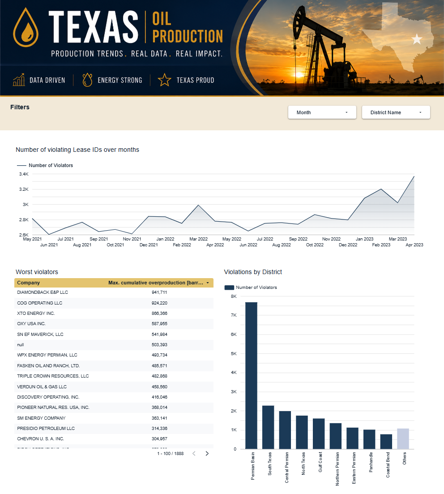
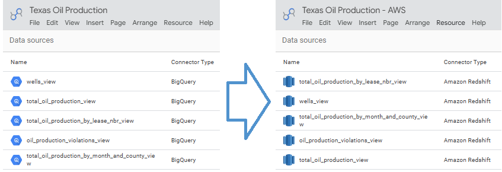
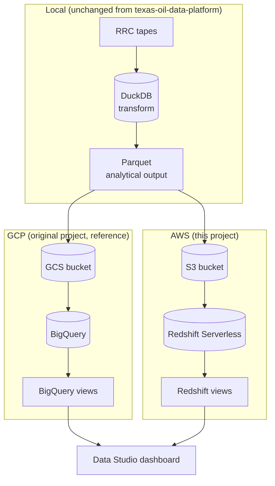
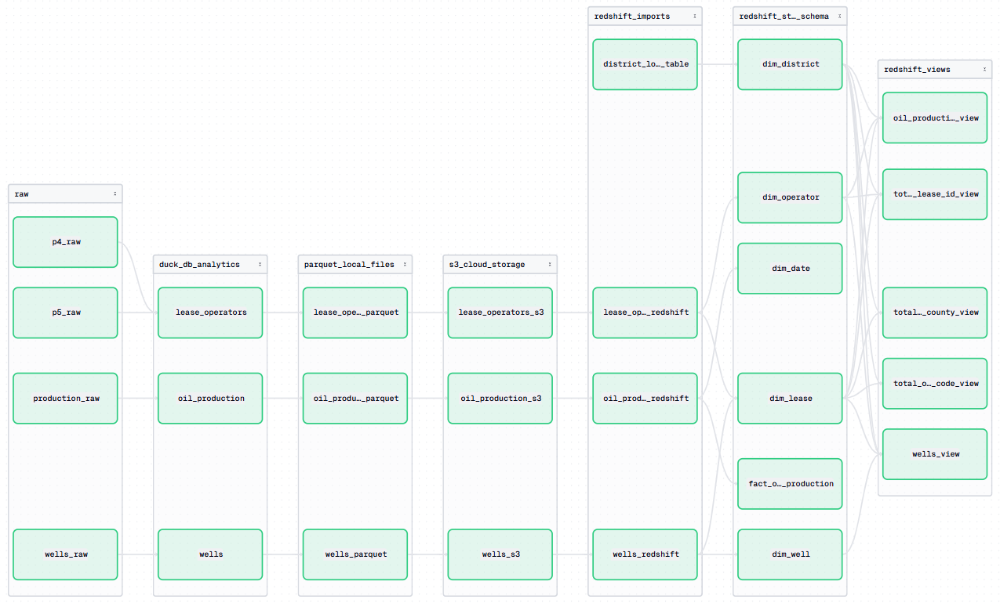

# Pipeline: GCP → AWS Migration

[](https://github.com/Shavril/pipeline-gcp-to-aws-migration/actions/workflows/ci.yml)
[](LICENSE)

An AWS port of [`texas-oil-data-platform`](https://github.com/Shavril/texas-oil-data-platform):
the same Texas Railroad Commission (RRC) oil production analytical pipeline and Data Studio
output, with the cloud storage and warehouse migrated from Google Cloud Platform (GCP) to 
Amazon Web Services (AWS).

This is a **cloud portability demonstration**. The data acquisition, local
transformations, business logic, analytical model, and dashboard are kept as close as possible
to the original; only the cloud-facing infrastructure changes. 
[Find out more about the original project](https://github.com/Shavril/texas-oil-data-platform).



**[View the live dashboard →](https://datastudio.google.com/reporting/d03eae0c-d131-4de7-9ce3-e53fc84aedd0)**

## Results

- Ported the cloud storage and data warehouse layer from **GCS + BigQuery** to **S3 + Redshift Serverless**, keeping the local pipeline, star schema, and Data Studio dashboard unchanged
- **Proved analytical equivalence, not just that it runs**: 6 canonical checks (row counts, total production, production by lease/district/county/operator) comparing live BigQuery and Redshift output — all match exactly (see [Validation](#validation-proving-the-migration-preserved-behavior))
- **Zero long-lived AWS credentials anywhere** — local development uses the standard AWS credential chain, GitHub Actions authenticates via OIDC federation to a short-lived IAM role
- **Terraform-managed AWS infrastructure** (S3, Redshift Serverless, IAM, OIDC, security groups)
- Validated a full **destroy → rebuild → re-run** cycle end to end through GitHub Actions
- Deliberately **kept the AWS surface area minimal**
- Cost-aware by design: a one-click `workflow_dispatch` workflow tears down the two billed resources (Redshift Serverless, S3) while leaving IAM/OIDC intact for a fast rebuild

## Contents

- [Results](#results)
- [What this demonstrates](#what-this-demonstrates)
- [Relationship to the original project](#relationship-to-the-original-project)
- [Architecture](#architecture)
- [GCP → AWS component mapping](#gcp--aws-component-mapping)
- [Architectural decisions](#architectural-decisions)
- [Validation: proving the migration preserved behavior](#validation-proving-the-migration-preserved-behavior)
- [Infrastructure](#infrastructure)
- [Orchestration](#orchestration)
- [CI/CD](#cicd)
- [Tech stack](#tech-stack)
- [Repository structure](#repository-structure)
- [Limitations and tradeoffs](#limitations-and-tradeoffs)
- [Running it](#running-it)
- [License](#license)

## What this demonstrates

- **Migrating cloud infrastructure without touching business logic** — the star schema, transform SQL, and Data Studio views are the same logic ported to a different SQL dialect. See [`docs/validation.md`](docs/validation.md) for the dialect differences that did need porting.
- **Live, programmatic validation against a reference implementation** — script (`scripts/compare_gcp_aws.py`) queries both warehouses and prints row counts and totals side by side.
- **Credential-free automation** — GitHub Actions deploys real AWS infrastructure via OIDC, with no access keys stored anywhere.
- **Deliberate architectural restraint** — every AWS service in this repo is here because the migration needed it. See [Architectural decisions](#architectural-decisions) for what was considered and rejected.
- **Cost-conscious cloud design** — Redshift Serverless is the one real ongoing cost; the infrastructure is split so it can be torn down and rebuilt on demand without touching IAM/OIDC.

## Relationship to the original project

[`texas-oil-data-platform`](https://github.com/Shavril/texas-oil-data-platform) is the reference
implementation: a from-scratch pipeline that reverse-engineers 4 legacy RRC mainframe tape
formats, validates them, and builds a BigQuery-backed dashboard. That project is kept as-is,
unmodified, and is the source of truth this project's AWS output is checked against.

This project's core idea is simple: swap the cloud provider underneath an existing pipeline —
GCP for AWS — without touching anything else. Everything from the RRC acquisition through the
local DuckDB transforms and the Parquet output already runs entirely on the local machine; it
was never GCP infrastructure to begin with, so there's nothing there to migrate.

```text
RRC website → Selenium acquisition (local) → ~11 GB raw files (local)
    → DuckDB transformations (local) → Parquet analytical output (local)
    → [ everything above is local, not cloud — nothing to migrate here ]
    → cloud storage → cloud warehouse → warehouse views → Data Studio
```

## Architecture



The same local pipeline output feeds two interchangeable cloud backends, both landing in the
same dashboard tool — the cloud layer is a swappable implementation detail.

## GCP → AWS component mapping

| Layer | Original (GCP)                  | This project (AWS)             |
|---|---------------------------------|--------------------------------|
| Raw ~11 GB source data | Local                           | Unchanged: local               |
| Local transformation | DuckDB                          | Unchanged: DuckDB              |
| Analytical files | Parquet                         | Unchanged: Parquet             |
| Object storage | GCS bucket                      | **S3 bucket**                  |
| Cloud warehouse | BigQuery                        | **Redshift Serverless**        |
| Warehouse views | BigQuery views                  | **Redshift views**             |
| Cloud SDK | `google-cloud-storage`, `google-cloud-bigquery` | `boto3` (S3 + Redshift Data API) |
| Local authentication | GCP service account             | Standard AWS credential chain / CLI profile |
| Infrastructure as code | Terraform                       | Terraform                      |
| CI/CD credentials | —                               | GitHub Actions + AWS OIDC (no long-lived keys) |
| Dashboard | Data Studio + BigQuery connector | Data Studio + native Redshift connector |

## Architectural decisions

<details>
<summary><strong>Why Redshift Serverless, not Athena + Glue?</strong></summary>

The dashboard needed to stay on Data Studio without adding a paid third-party connector.
Redshift Serverless has a native Data Studio connector.

</details>

<details>
<summary><strong>Why no Lambda?</strong></summary>

The architecture is deliberately as simple as it can be: local pipeline → S3 → Redshift
Serverless → Data Studio. Lambda would add a compute service with no actual job for it to
do — the local pipeline already runs the transform and load steps.

</details>

<details>
<summary><strong>Why does Dagster stay local-only?</strong></summary>

Dagster orchestrates local development the same way it did in the original project. This
project is about porting cloud infrastructure, not about standing up a "Dagster on AWS"
deployment — no persistent Dagster server/webserver/daemon runs in AWS.

</details>

<details>
<summary><strong>Why OIDC federation instead of stored AWS access keys?</strong></summary>

GitHub Actions assumes a short-lived IAM role via OIDC (`aws-actions/configure-aws-credentials`)
instead of long-lived access keys in repository secrets — nothing durable to leak if a workflow
or a dependency is compromised.
</details>

<details>
<summary><strong>Why is the Terraform state bucket not managed by this project's own Terraform config?</strong></summary>

State has to survive the exact resources it's tracking. If it lived in the same bucket
`destroy-costly-resources` tears down, that workflow would delete Terraform's own record of
everything else the moment it ran. The state bucket is a separate, manually-created,
versioned/encrypted bucket outside this config's management, with S3-native locking
(`use_lockfile`) instead of a second DynamoDB service.

</details>

## Validation: proving the migration preserved behavior

The GCP project is treated as the reference implementation. `scripts/compare_gcp_aws.py`
queries both warehouses' own copies of the same star-schema tables and Data-Studio-facing views —
built from identical business logic on both sides — and prints row counts and totals next to
each other.

```
Check                                                | GCP rows  | AWS rows  | Rows  | GCP total     | AWS total     | Total
-----------------------------------------------------+-----------+-----------+-------+---------------+---------------+------
fact_oil_production (raw grain)                      | 1,625,955 | 1,625,955 | MATCH | 2,978,117,307 | 2,978,117,307 | MATCH
total_oil_production_by_lease_id_view                | 73,680    | 73,680    | MATCH | 2,978,117,307 | 2,978,117,307 | MATCH
total_oil_production_by_month_and_district_code_view | 312       | 312       | MATCH | 2,978,117,307 | 2,978,117,307 | MATCH
total_oil_production_by_month_and_county_view        | 14,244    | 14,244    | MATCH | 2,978,117,307 | 2,978,117,307 | MATCH
wells_view                                           | 623,014   | 623,014   | MATCH | 2,766,230,335 | 2,766,230,335 | MATCH
total_oil_production_by_operator                     | 3,639     | 3,639     | MATCH | 2,978,117,307 | 2,978,117,307 | MATCH

All checks match.
```

Every check matched exactly — row counts, total oil production, and total well depth are
identical between the BigQuery reference and the Redshift port. Full approach, what's
deliberately excluded (a "production by field" metric — neither project's model tracks a
"field" concept), and how to run it yourself: [`docs/validation.md`](docs/validation.md).

Beyond the query-level checks above, I also compared both Data Studio reports directly after
standing up the Redshift version — same charts, same numbers, side by side, and they match:

[Original: Texas Oil Production Data Studio report](https://datastudio.google.com/u/0/reporting/7189159a-8735-4d7c-b3e6-1fa7334b697b)  
[Migrated: Texas Oil Production - AWS Data Studio report](https://datastudio.google.com/u/0/reporting/d03eae0c-d131-4de7-9ce3-e53fc84aedd0)

## Infrastructure

Terraform provisions the S3 bucket, the Redshift Serverless namespace/workgroup, the IAM role
Redshift assumes to read S3, the security group Data Studio's connector needs, and the OIDC
setup GitHub Actions authenticates through. Everything was verified manually first, then
imported into Terraform state — `terraform plan` shows zero diff against the live resources.
Full details, including the exact IAM permission set required: [`terraform/README.md`](terraform/README.md).

**Cost.** Redshift Serverless is the dominant real cost (pinned to the current AWS minimum of
4 RPU, billed per-second only while processing queries); S3 costs a fraction of a cent per
month at this project's data volume. Everything else — IAM roles, the OIDC provider, the
security group — is free to leave running indefinitely.

**Tearing down and rebuilding.** Three `workflow_dispatch`-only GitHub Actions workflows:

- **`deploy-terraform`** — `terraform init/plan/apply`, plus a safeguard step that grants the
  Redshift system privileges the pipeline needs regardless of which identity currently holds
  superuser (see [Architectural decisions](#architectural-decisions)).
- **`destroy-costly-resources`** — tears down just Redshift Serverless and S3 (the two billed
  resources), leaving IAM/OIDC/security groups intact so `deploy-terraform` can rebuild
  everything on demand.
- **`destroy-everything`** — a full `terraform destroy`, gated behind typing a literal
  confirmation phrase. Used only when actually done with the project.

## Orchestration

Dagster is the same local-only orchestration layer as the original project — no persistent
Dagster server runs in AWS (see [Architectural decisions](#architectural-decisions)). Three
jobs, split by how often each part actually needs to run rather than by execution order:

- **`data_refresh_job`** — the routine extract → transform → load pipeline, top to bottom,
  ending in the S3 upload and Redshift table load.
- **`star_schema_job`** — (re-)builds the fact/dimension tables on demand.
- **`analytics_views_job`** — (re-)builds the Data Studio-facing Redshift views, and the star
  schema they depend on.

This is a real, end-to-end run, not separate pieces demonstrated in isolation: Terraform
provisioned the S3 bucket and Redshift Serverless namespace above, Dagster then materialized
every asset from the raw RRC files through the Redshift views against that real
infrastructure, and the Data Studio report was refreshed and checked against the result
afterward (see [Validation](#validation-proving-the-migration-preserved-behavior)) — the full
chain, not just each layer tested on its own.



## CI/CD

`ci.yml` runs the test suite, lint, and type-check on every push and pull request against
`main`. The three Terraform workflows above are `workflow_dispatch`-only — deploying or
tearing down real AWS infrastructure never happens automatically on a push.

## Tech stack

| Layer | Tool |
|---|---|
| Language / tooling | Python 3.13, [uv](https://docs.astral.sh/uv/) |
| Local processing & storage | pandas, [DuckDB](https://duckdb.org), Parquet (unchanged from the GCP project) |
| Data validation | [pandera](https://pandera.readthedocs.io) (unchanged) |
| Orchestration | [Dagster](https://dagster.io), local-only (unchanged) |
| Configuration | [pydantic-settings](https://docs.pydantic.dev/latest/concepts/pydantic_settings/) |
| Cloud object storage | Amazon S3 (`boto3`) |
| Cloud warehouse | Redshift Serverless (Redshift Data API, IAM auth) |
| Dashboarding | Data Studio, native Amazon Redshift connector |
| Infrastructure as code | Terraform (S3 remote state, no DynamoDB lock table) |
| CI/CD | GitHub Actions, OIDC federation to AWS (no stored credentials) |
| Testing / linting / types | pytest + coverage.py, [ruff](https://docs.astral.sh/ruff/), [mypy](https://mypy-lang.org) |

## Repository structure

```
pipeline-gcp-to-aws-migration/
├── data/                 # gitignored — raw RRC files (NTFS junctions into the sibling repo), DuckDB, Parquet
├── docs/                 # migration-specific documentation (validation approach/results)
├── src/oil_pipeline/
│   ├── extract/          # unchanged from the GCP project — tape format parsers
│   ├── transform/        # unchanged business logic + Redshift view definitions
│   ├── validation/       # unchanged — pandera schemas, raw + transformed checks
│   ├── load/             # duckdb.py/parquet.py unchanged; s3.py + redshift.py replace gcs.py/bigquery.py
│   ├── dagster_defs/     # local-only orchestration (unchanged)
│   └── config.py         # pydantic-settings: AWS settings replace the old GCP ones
├── scripts/
│   ├── compare_gcp_aws.py            # the GCP-vs-AWS validation script
│   └── gcp_aws_validation_queries.py # the checks it runs
├── terraform/            # S3, Redshift Serverless, IAM, OIDC, security groups
├── tests/                # unchanged test suite (unit tests + an opt-in smoke test)
├── definitions.py        # Dagster entry point (`dagster dev`)
└── .github/workflows/    # ci.yml (test/lint/type-check) + 3 workflow_dispatch Terraform workflows
```

## Running it

### Prerequisites

- Python 3.13, [uv](https://docs.astral.sh/uv/), the [AWS CLI](https://aws.amazon.com/cli/)
  (used to create the Terraform state bucket in step 3 below), and
  [Terraform](https://developer.hashicorp.com/terraform/install)
- An AWS account, with credentials configured locally (`aws configure`, an SSO profile, or
  equivalent) — see [`terraform/README.md`'s Prerequisites section](terraform/README.md#prerequisites-iam-permissions-for-whoever-runs-terraform)
  for the exact IAM permission set the account needs
- The 4 raw RRC files, acquired the same way as in the original project — see
  [`texas-oil-data-platform`'s own instructions](https://github.com/Shavril/texas-oil-data-platform#getting-the-raw-files).
  This project doesn't re-acquire them; it only points at wherever you already have them.
- Optional, only needed for the validation script: a GCP project with the original pipeline's
  BigQuery output already loaded, plus `gcloud auth application-default login`

### Steps

```bash
# 1. Install dependencies
uv sync

# 2. Copy the .env template and fill the first part
cp .env.example .env

# 3. Create your own Terraform state bucket. Terraform state can't live inside a
#    bucket this same config can destroy (see terraform/README.md's
#    "Remote state" section for why), so it's a separate, manually-created bucket.
aws s3api create-bucket --bucket <your-unique-bucket-name> --region us-east-1
aws s3api put-bucket-versioning --bucket <your-unique-bucket-name> --versioning-configuration Status=Enabled
aws s3api put-bucket-encryption --bucket <your-unique-bucket-name> --server-side-encryption-configuration '{"Rules":[{"ApplyServerSideEncryptionByDefault":{"SSEAlgorithm":"AES256"}}]}'
# edit terraform/providers.tf's backend "s3" block: bucket = "<your-unique-bucket-name>"

# 4. Provision AWS infrastructure (one-time, or whenever it changes)
cd terraform
terraform init
terraform apply
terraform output   # each output names the exact .env variable it maps to
cd ..
# copy each output value into .env (S3 bucket name, Redshift workgroup
# name, the Redshift-to-S3 IAM role ARN)

# 5. Run the pipeline via Dagster
uv run dagster dev
# open http://localhost:3000

# 6. Run the tests
uv run pytest

# 7. Lint and type-check — same checks CI runs
uv run ruff check src tests definitions.py
uv run mypy

# 8. Optional: validate the AWS output against a GCP reference (only
#    meaningful if you also have the original project's BigQuery output)
uv sync --group validation
uv run python scripts/compare_gcp_aws.py
```

Deploying via GitHub Actions instead of running Terraform locally (OIDC, no stored AWS
credentials) is a separate, optional setup — see
[`terraform/README.md`'s GitHub Actions deployment section](terraform/README.md#github-actions-deployment).

Validating the migration has requirements described in: [`docs/validation.md`](docs/validation.md).

## License

[GNU GPLv3](LICENSE)
